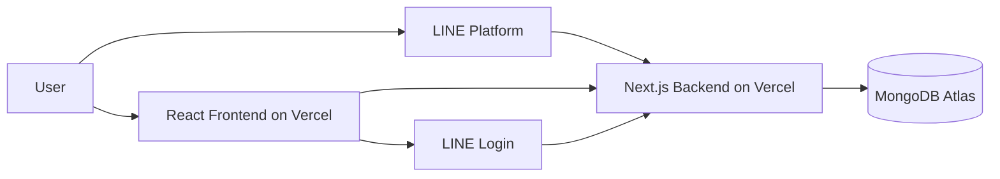

# Wallet Tree

Personal income and expense tracking application accessible through LINE chatbot and a responsive web dashboard.



## Features

- Record income and expenses via LINE chatbot or web dashboard
- Add daily expense notes
- View daily and monthly summaries
- Categorize transactions with custom categories
- Secure LINE Login authentication
- Multi-user data isolation
- Thailand timezone support (Asia/Bangkok)
- Responsive mobile-first design

## Monorepo architecture

```
wallet-tree/
├── apps/
│   ├── frontend/          # React + Vite dashboard
│   └── backend/           # Next.js API server
├── packages/
│   └── shared/            # Shared types, schemas, constants
├── .github/workflows/     # CI pipeline
└── pnpm-workspace.yaml
```

## React frontend architecture

- **Framework**: React 19 with TypeScript
- **Bundler**: Vite 6
- **Styling**: Tailwind CSS 3
- **Routing**: React Router 7
- **Data fetching**: TanStack Query 5
- **Forms**: React Hook Form with Zod validation
- **Charts**: Recharts
- **Deployment**: Vercel

### Frontend pages

| Route              | Page              |
| ------------------ | ----------------- |
| `/`                | Landing page      |
| `/login`           | LINE Login entry  |
| `/auth/callback`   | Auth callback     |
| `/dashboard`       | Dashboard overview |
| `/transactions`    | Transaction list  |
| `/transactions/new`| Add transaction   |
| `/transactions/:id/edit` | Edit transaction |
| `/monthly-summary` | Monthly report    |
| `/categories`      | Category management |
| `/profile`         | User profile      |
| `/settings`        | Settings          |

## Next.js backend architecture

- **Framework**: Next.js 15 with App Router
- **Language**: TypeScript
- **Database**: MongoDB Atlas (via `mongodb` driver)
- **Validation**: Zod
- **Authentication**: LINE Login with cookie sessions
- **Chatbot**: LINE Messaging API
- **Deployment**: Vercel

### API endpoints

| Method | Path                          | Description          |
| ------ | ----------------------------- | -------------------- |
| GET    | `/api/health`                 | Health check         |
| GET    | `/api/profile`                | Get user profile     |
| PATCH  | `/api/profile`                | Update profile       |
| GET    | `/api/categories`             | List categories      |
| POST   | `/api/categories`             | Create category      |
| PATCH  | `/api/categories/:id`         | Update category      |
| DELETE | `/api/categories/:id`         | Delete category      |
| GET    | `/api/transactions`           | List transactions    |
| POST   | `/api/transactions`           | Create transaction   |
| GET    | `/api/transactions/:id`       | Get transaction      |
| PATCH  | `/api/transactions/:id`       | Update transaction   |
| DELETE | `/api/transactions/:id`       | Delete transaction   |
| GET    | `/api/summaries/daily`        | Daily summary        |
| GET    | `/api/summaries/monthly`      | Monthly summary      |
| GET    | `/api/auth/line`              | LINE Login redirect  |
| GET    | `/api/auth/line/callback`     | LINE Login callback  |
| POST   | `/api/auth/logout`            | Logout               |
| GET    | `/api/auth/session`           | Get current session  |
| POST   | `/api/line/webhook`           | LINE webhook         |

## MongoDB Atlas setup

1. Create a free cluster at [MongoDB Atlas](https://www.mongodb.com/atlas)
2. Create a database user with read/write permissions
3. Whitelist your IP addresses (or `0.0.0.0/0` for Vercel)
4. Copy the connection string (`MONGODB_URI`)

## LINE Messaging API setup

1. Go to [LINE Developers Console](https://developers.line.biz/console/)
2. Create a new provider and a Messaging API channel
3. Get `LINE_CHANNEL_ID`, `LINE_CHANNEL_SECRET`, `LINE_CHANNEL_ACCESS_TOKEN`
4. Set the webhook URL to `https://wallet-tree-api.vercel.app/api/line/webhook`

## LINE Login setup

1. In the same LINE provider, create a LINE Login channel
2. Set the callback URL to `https://wallet-tree-api.vercel.app/api/auth/line/callback`
3. Get `LINE_LOGIN_CHANNEL_ID` and `LINE_LOGIN_CHANNEL_SECRET`

## Environment variables

### Frontend (`apps/frontend/.env`)

```env
VITE_APP_NAME=Wallet Tree
VITE_API_BASE_URL=http://localhost:3000
```

### Backend (`apps/backend/.env`)

```env
MONGODB_URI=mongodb+srv://...
MONGODB_DB_NAME=wallet-tree

LINE_CHANNEL_ID=
LINE_CHANNEL_SECRET=
LINE_CHANNEL_ACCESS_TOKEN=

LINE_LOGIN_CHANNEL_ID=
LINE_LOGIN_CHANNEL_SECRET=
LINE_LOGIN_CALLBACK_URL=http://localhost:3000/api/auth/line/callback

FRONTEND_URL=http://localhost:5173
ALLOWED_ORIGINS=http://localhost:5173

SESSION_SECRET=<32-char-min>
CSRF_SECRET=<32-char-min>
NEXT_PUBLIC_BACKEND_URL=http://localhost:3000
```

## Local development

```bash
# Install dependencies
pnpm install

# Start both frontend and backend
pnpm dev

# Start individually
pnpm dev:frontend   # http://localhost:5173
pnpm dev:backend    # http://localhost:3000
```

## Testing

```bash
pnpm test
pnpm typecheck
pnpm lint
```

## GitHub Actions

The CI pipeline runs on push/PR to `main`:

1. Install dependencies
2. Build shared package
3. Frontend typecheck
4. Backend typecheck
5. Backend tests
6. Frontend production build
7. Backend production build

## Deploying the frontend to Vercel

1. Create a Vercel project from the GitHub repository
2. Set **Root Directory** to `apps/frontend`
3. Set **Framework Preset** to `Vite`
4. Add environment variable:
   - `VITE_API_BASE_URL=https://wallet-tree-api.vercel.app`
5. Deploy

Expected URL: `https://wallet-tree.vercel.app`

## Deploying the backend to Vercel

1. Create a second Vercel project from the same repository
2. Set **Root Directory** to `apps/backend`
3. Set **Framework Preset** to `Next.js`
4. Add all backend environment variables
5. Deploy

Expected URL: `https://wallet-tree-api.vercel.app`

## Configuring CORS

The backend allows cross-origin requests from configured origins. Set `ALLOWED_ORIGINS` as a comma-separated list:

```env
ALLOWED_ORIGINS=https://wallet-tree.vercel.app,http://localhost:5173
```

The backend returns `Access-Control-Allow-Origin` with the specific requesting origin, not `*`. Credentials are supported with `Access-Control-Allow-Credentials: true`.

## Configuring authentication cookies

The session cookie is named `wallet-tree-session` with:
- `HttpOnly` (not accessible via JavaScript)
- `Secure` in production
- `SameSite=None` in production (cross-site)
- `SameSite=Lax` in development
- 7-day expiration

For cross-domain cookies to work in production, both frontend and backend must use `https`.

## Setting the LINE webhook URL

Configure the webhook in the LINE Developers Console:

```
https://wallet-tree-api.vercel.app/api/line/webhook
```

The webhook verifies the `x-line-signature` header against the raw request body using `LINE_CHANNEL_SECRET`.

## Security notes

- All user data is isolated by `userId` derived from the server session
- MongoDB credentials, LINE secrets, and session secrets are never exposed to the frontend
- Webhook signatures are verified for every LINE event
- Zod validation is applied to all API inputs
- CORS rejects unapproved origins
- Monetary values are stored as integer satang (not floating-point)
- Rate limiting should be added in production

## Known limitations

- PKCE is not yet implemented for LINE Login
- No rate limiting on API endpoints
- LINE Rich Menu requires manual setup in LINE Developer Console
- Webhook replay protection is basic (no idempotency key checking yet)
- No automated database migration system

## Future improvements

- Add PKCE support for LINE Login
- Implement rate limiting
- Add data export (CSV/PDF)
- Add budget planning features
- Support multiple currencies with exchange rates
- Add recurring transaction support
- Add receipt image upload via LINE
- Implement push notifications for reminders
- Add shared/group expenses
